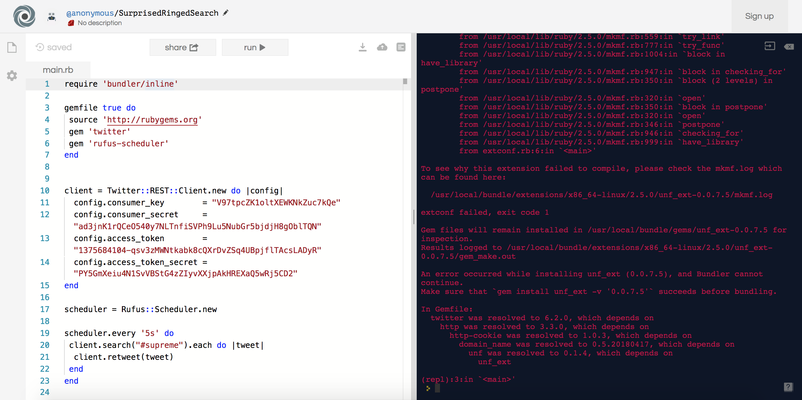
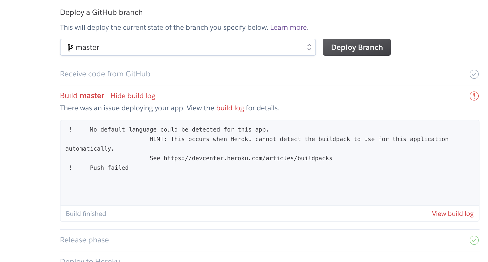

# Packaging the TwitterBot
Before deploying it on a server, I wanted to fix the syntax of the bot. The function of the bot is to search for the hashtag "giveaway" and repost it. I thought that this would be a useful bot because I would be able to win give aways.

The syntax for my MVP has a similar function but it does not exactly retweet specific posts. It takes the user's screen name plus the text and tweets it on my page. This was a working code but I actually wanted the code to retweet Therefore, I google the retweet method which I got `.retweet`. 

**MVP Code (BEFORE):**

``` ruby 
require 'rufus-scheduler'
require 'twitter'

client = Twitter::REST::Client.new do |config|
  config.consumer_key        = "YOUR CONSUMER KEY"
  config.consumer_secret     = "YOUR CONSUMER SECRET"
  config.access_token        = "YOUR ACCESS TOKEN"
  config.access_token_secret = "YOUR TOKEN SECRET"
end

scheduler = Rufus::Scheduler.new

scheduler.every '5s' do
 client.search("#giveaway").each do |tweet| # Looks for the hashtag, then takes each
  client.update("@#{tweet.user.screen_name}: #{tweet.text}") #take username and tweet and tweet it on my page 
end
end

scheduler.join
```
Looks for the hashtag, then takes each tweet and take username and tweet and tweet it on my page. 

**FINAL Code (AFTER):**

``` ruby 
require 'rufus-scheduler'
require 'twitter'

client = Twitter::REST::Client.new do |config|
  config.consumer_key        = "YOUR CONSUMER KEY"
  config.consumer_secret     = "YOUR CONSUMER SECRET"
  config.access_token        = "YOUR ACCESS TOKEN"
  config.access_token_secret = "YOUR TOKEN SECRET"
end

scheduler = Rufus::Scheduler.new

scheduler.join
scheduler.every '5s' do 
 client.search("#giveaway").each do |tweet| #Looks for the hashtag, then takes each 
  client.retweet(tweet) #retweet it
 end 
end 

scheduler.join
```
Looks for the hashtag, then takes each and retweets it. 
After adjusting the code to function the way I want, I can deploy it onto a server so that it will run without having to type the command `ruby filename.rb`. 

# Deploying 

First, I tried to use [repl.it](https://repl.it/) to deploy since it recently updated allowing users to use gems.

In order to use gems we need the following code: 
```ruby
require 'bundler/inline'

gemfile true do 
 source 'http://rubygems.org'
 gem ' ' #gem name 
end
```

[](https://repl.it/repls/SurprisedRingedSearch)

Unfortunately, I got an error and can't seem to figure out why.I tried googling the error but nothing seems to help. 

The next place I tried was [Heroku](https://dashboard.heroku.com/apps). I tried deploying by connecting to github and through heroku git, but I got another error. It gave me the error saying "no default language could be detected for this app."



Which I then installed the ruby buildpack using the command `heroku buildpacks:set heroku/ruby` and ran the command `git push heroku master`. Unfortunately, this did not work as well. I will continue to look for different ways to deploy the twitter bot. If I can't seem to figure out a way then I will run it on Cloud9. Since I have the scheduler gem I am able to set it to run at a certain time. I know this might be the most convient way but that it a working idea. 

# Takeaways
- When one method doesn't work, try another method. 
- Keep googling to see what different options there are.  