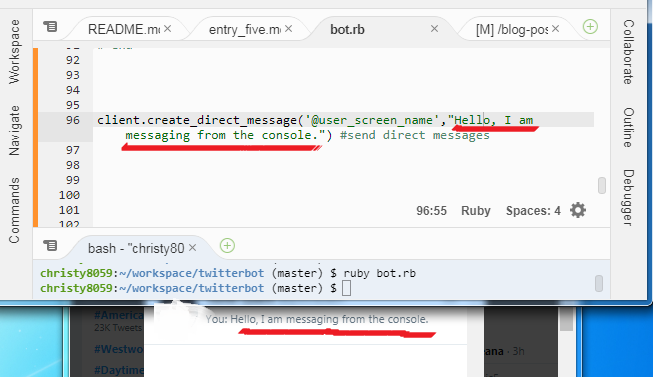
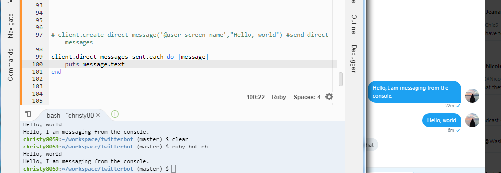
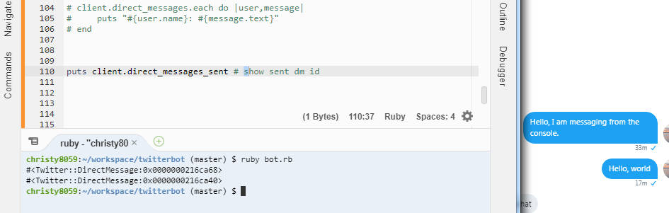
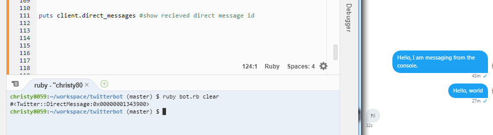

# Direct Message(DM)

After last weeks unsuccessful trial on methods for direct messages, I was determined to figure it out this week. I looked over the syntax, possible spacing errors, and even googled what the problem is but nothing really helped.

Since nothing worked and I had no idea what is wrong, I decided to double check on the permission page on the [twitter app](https://apps.twitter.com/) I made sure it was on "Read, write, and direct messages". Afterwards I regenerated the access token and keys, and as well as the consumer key & Secret" and replaced the old ones. Finally it worked and I felt accomplished. 


## Create Direct Message

<br>

<br>

``` ruby 
client.create_direct_message('@user_screen_name',"The message you want to send them")

```

To create a direct message the method is `.create_direct_message`. In the parenthesis I am passing in two arguements. The first one is the user's screen name which is wrapped in one quotation mark with the "@" symbol. Then followed by a comma and double quotes with the message you would like to send to that person. 

As always to run the file you would have to go into your console and type `ruby filename.rb` 

## DM Sent

<br> 

<br> 

``` ruby 
client.direct_messages_sent.each do |message|
    puts message.text
end
```

This is a random function that I made. This function puts all the messages that I've sent before and prints it out in the console. The most recent one is always the first one. This uses iteration and the method  `.each` to print each one out. 


## Destroying Dm 
** Note ** : To delete direct messages we have to use the ID #. Each message that is sent and recieved are labeled with a number (like a tag). 

### How to get ID numbers for direct messages that you sent
<br> 

<br>

``` ruby 
puts client.direct_messages_sent # show sent dm id
```
The line above uses the command `puts` and the method `.direct_messages_sent` to show the id number. The default of the method is an ID number. Note: there is only two ID numbers, because I only sent two direct messages in total. 

## How to get ID numbers for messages that you receive

<br> 

<br> 

``` ruby 
puts client.direct_messages #show recieved direct message id
```
The line above uses the command `puts` and the method `.direct_messages` to show the id number for messages that I've received. The default of the method is an ID number. Note: there is only one ID numbers, because I only got one direct messages in total. 


## To delete messages recieved  

<br> 

<br> 


``` ruby 
client.destroy_direct_message(client.direct_messages_sent) #delete message I sent 
```

This method uses id numbers to delete messages, therefore we can use the 
`client.direct_messages_sent` as the value (inside the parenthesis 

## To delete messages sent

<br> 

<br> 

``` ruby 
client.destroy_direct_message(client.direct_messages)#delete messages I receieve
```

This method also uses ID numbers to delete direct_messages receieve, therefore we pass 


# Timeline 
After studying methods for direct messages I also learned two more methods that grabs the the tweets on my timeline. 


<br> 

<br> 


``` ruby 
puts client.home_timeline # prints the tweet ID on my time line 
```
 
Default it print out the 20 most recent tweet id into the console using `puts`


## To print the text of the tweet from timeline

<br> 

<br> 

```ruby 
client.home_timeline.take(1).each do |tweet| #takes the tweets on my timeline 
      puts "#{tweet.user.screen_name}: #{tweet.text}" # take each tweets user screen name and post their tweets in the console.
end 
```

This grabs the first tweet on my feed and prints the user screen name and the tweet that they've posted. 