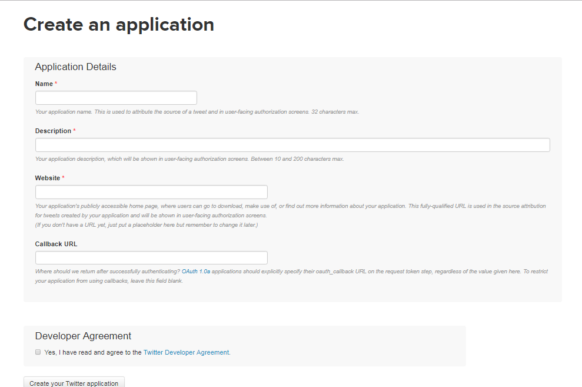
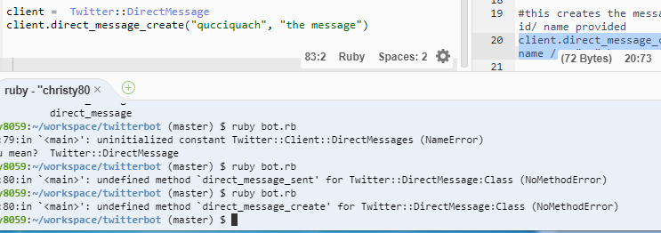

# Learning. Learning. Learning. 

From the beginning of my study, I thought that there weren't documentation for ruby twitter bots. With perseverance, I continued to scroll through and search on google using different keywords like "API twitter and ruby". Turns out this [rubydoc](http://www.rubydoc.info/gems/ifttt-twitter/2.1.1/Twitter/Client) was super helpful. 

At first, I tried learning how to view and create direct messages but it didn't work. It was frustrating because none of my peers nor my teacher studied this topic before. I had to count on my own and google to find answers.


**IMPORTANT**

In order to _allow access to direct messages_ I had to change the customer key and secret. To do so, I went back to the [twitter app](https://apps.twitter.com/) and changed the permission to "Read, Write and Access direct messages"(option 3)  

<br> 

<br> 

``` ruby
#return direct message with id
client.direct_message(id#)  

#this creates the message and sends it to the id/ name provided
client.direct_message_create("username screen name / ID", "the message")

#delete or destroy the direct message using id #
client.direct_message_destroy(id#)

#returns 20 most sent to 
client.direct_message

#returns 20 most recent sent by 
client.direct_message_sent
```
This block of code is possible methods you can do with direct messages. 

I realized that it wasn't working when I tried to run ruby bot.rb. Error messages like "NoMethodError", or "can not access direct_message" therefore I moved on to learning how to favorite tweets. 

<br>

<br>

## Seach for a tweet 

``` ruby 
client.search('#whatever_you're_searching_for)
```


## Favoriting (Liking) Tweets

``` ruby
#favoite a tweet using an ID # 
client.favoite(id#)

# to unlike a tweet 
client.unfavorite using ID #
```

At first, I had to play around with the syntax to see how it works. To print it in the console you put the work `puts` before your method and then run `ruby filename.rb`. 

After learning simple methods to retrieve some tweet or id I decided to create a small method. 

```ruby 
client.search("#disney").take(2).each do |tweet|#seach for this hashtag, take 1st result 
    puts "#{tweet.user.screen_name}: #{tweet.text}"# print in console
    client.favorite(tweet) #fav means to like
end

```

This block of code searches for the hashtag "disney" using `.search`. Then it takes the first two results (`.take(2)`) and for each one (`.each`) put the screen_name of the user and the tweet that includes the hashtag in the console. lastly, the post is being favorited using `.favorite`.  

<br>

<br>

Next, I tried the method `.unfavorite` but I needed the tweet ID. Before I got this to work  I was trying `.each` to get the ID first then unfavorite it. This didn't work so I decided to put  `client.favorites` as my parameter since that is the ID # if we just wrote the line `put client.favoites`. 


``` ruby 
client.unfavorite(client.favorites)# unlike all 
client.unfavorite(client.favorites.first)#unlike the first liked tweet
```


