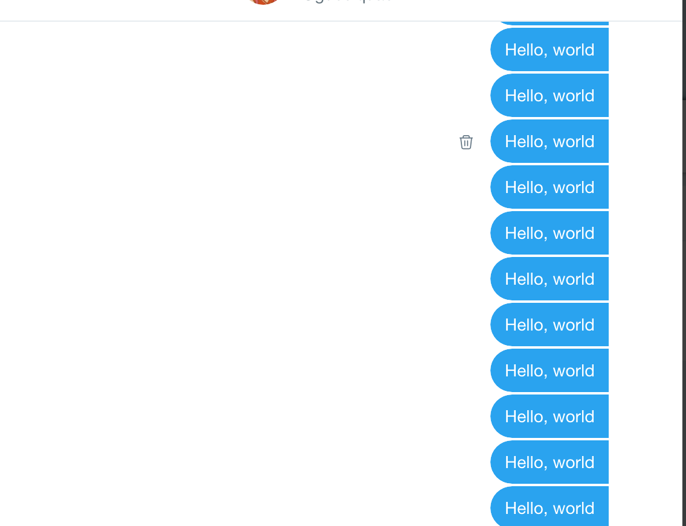

# Scheduler
The hardest thing about learning on your own is that no one is there to tell you the answers to your problem. Everything is done independently. Last week I focused on a way to schedule tasks to run at a certain time or a certain number of times. First, I tried using _**Cron Job**_ [(see last weeks entry)](entries/entry_six.md), but I was unsuccessful in accurately running the cron job. I YouTubed some tutorials on how to work cron jobs but it did not work.

# What did I do next? 
I searched for alternative ways to schedule ruby tasks. By doing so I came across the gem documentation for [rufus-scheduler](https://github.com/jmettraux/rufus-scheduler). This helped me a lot because I was able to find several other gems that schedule ruby tasks. This is beneficial since it is written in the ruby file which I can simply use the command  `ruby filename.rb` to test it out. 


# Scheduler Gem
This is a gem that uses threads to schedule tasks. 

To get started...

1. In your ruby file require the gem `rufus-scheduler`. 

2. Then create a new variable. You can call it scheduler or anything approperate. By doing so we are calling on a variable giving it a specific command. 

```ruby 
scheduler = Rufus::Scheduler.new
``` 
3. To schedule some we call on the variable scheduler and attach a method to it.

For the scheduler we can set it to please our likings. If we want to make it every second (s) or minute (m) we can use the method `.every`. This task is looping until you tell it to stop or it crashes. 

**For example:**
```ruby 
scheduler.every '5s' do
    #something every 5s
end 
```
To schedule something 'in' a certain amount of time we use the method `.in`. 

**For example:**

```ruby 
scheduler.in '5d' do
  # do something in 5 days
end
```

To schedule at a specific time you use the command `.at`. 

**For example:**

```ruby
scheduler.at '2030/12/12 23:30:00' do
  # do something at a given point in time
end
```


4. We finish off with `scheduler.join`. This wil let the current thread join the scheduler thread. 

A complete scheduler would look like this 

```ruby 
scheduler.every '5s' do
    #something every 5 seconds.
end

scheduler.join
```

5. To run the ruby file you type `ruby filename.rb`

# Test runs 
Now that we can schedule tasks we can connect it to twitter and do amazing things with it. 

**Example #1**
```ruby 
require 'rufus-scheduler'
require 'twitter'

client = Twitter::REST::Client.new do |config|
  config.consumer_key        = "YOUR KEY"
  config.consumer_secret     = "YOUR SECRET"
  config.access_token        = "YOUR TOKEN"
  config.access_token_secret =YOUR TOKEN SECRET" 
end

scheduler = Rufus::Scheduler.new

scheduler.every '5s' do
 client.search("#supreme").each do |tweet|
  client.update("#{tweet.user.screen_name}: #{tweet.text}")
 end
end

scheduler.join
```
This will look for a specific tag and take the user's screen name and tweet and tweet it on your account. This will be done evert 5 seconds. 




**Example #2**
```ruby 
require 'rufus-scheduler'
require 'twitter'

client = Twitter::REST::Client.new do |config|
  config.consumer_key        = "YOUR KEY"
  config.consumer_secret     = "YOUR SECRET"
  config.access_token        = "YOUR TOKEN"
  config.access_token_secret =YOUR TOKEN SECRET" 
end

scheduler = Rufus::Scheduler.new

scheduler.every '5s' do
 client.create_direct_message('@user_screen_name',"your message")
end

scheduler.join
```
This will send a direct message to the specific user with the specific message every 5 seconds. 


# MVP

After learning how to schedule a ruby task I am now able to make an MVP(minimal,vibal, product). I developed on the idea of looking for a specific hashtag. And from there I would retweet and like the post. 