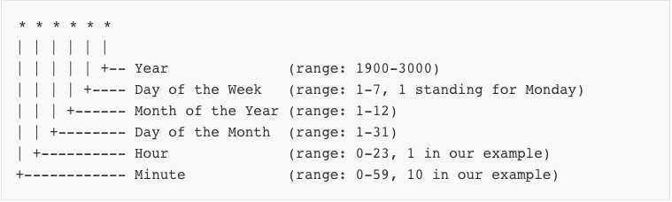
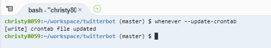
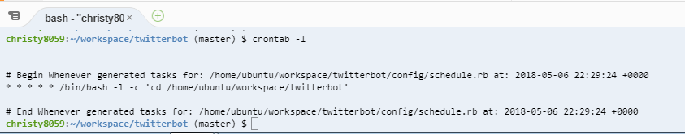

This week I was thinking about what can I make now that I know the simple commands for Twitter on a command line. I thought to myself that a bot must run constantly, if not at least for a time period.
I realized that I needed to figure out a way to allow my ruby file to run at a specific time and repeat the task. After doing some research I found that "cron job" would do the job. 


# What is Cron Job?
Cron Job is a command that can schedule tasks to be automatically run given a certain time or date. This is helpful since the task can be done repeatedly.


## Setup Cron Job

1. Install the `whenever` gem. 
``` ruby 
gem install whenever
```

2. Then initialize whenever in your route directory.

```ruby
whenever .
```

This creates a config directory with a file name schedule.rb 

3.  You will write your code in the schedule.rb file. 
The syntax for when you want to schedule the task would look like this. 

[](https://www.sitepoint.com/schedule-cron-jobs-whenever-gem/)


Ruby makes it much easier to write the syntax. For example:

``` ruby 
#hour
every 2.hours do 
end 

#everday at a certain time 
every 1.day, at: '5:53 pm' do
end 

#run at two specific time everyday 
everyday 1.day , at: ['2:00 pm', '4:00 pm'] do 
end 

#every hour 
every :hour do 
end 
```
and many options (:hour, :day, :month, :year, :reboot). In between the block, there are three commands you can use: rack, command, and runner. 

rack: runs a rack task defined in the application
runner: allows you to input an executable (a file or program able to be run by a computer) piece of code as a string to be run at a particular interval
command: accepts a script to be run at an interval 

4. Once you edit it you need to update your crontab. 

``` ruby 
whenever --update-crontab
```

5. To check the task that is scheduled
``` ruby
crontab -l
```
This will list all the crontabs that you have scheduled in your console. 

# Testing 
I tested the scheduler to fit my bot, but unfortunately it did not run as I expected it to. Nothing happened which I don't seem to know why.

My code:
```ruby
job_type :custom_runner, "cd :path"

every 1.minute do
    custom_runner "/workspace/twitterbot/bot.rb"
end 
```
I decided to do a custom runner which uses directory path. To test it out I wanted the bot to run every minute and it will go into the "twitterbot" directory and run the bot.rb file. 




# Final Project Idea
I searched up different [twitterbot examples](https://www.digitaltrends.com/social-media/the-10-best-twitter-bots-you-arent-following/669990) and found some common use such as spamming, retweeting, liking and etc. For my Twitterbot, I want to be able to search for the hashtag "inspiring quotes" and then retweet it onto my feed. This would create a page of inspiring quotes so whenever someone is in need of a quote for their Instagram picture then my page would be useful. 

# Sources
GitHub whenever gem - https://github.com/javan/whenever
Job Type explanation - https://www.sitepoint.com/schedule-cron-jobs-whenever-gem/

# Takeaway
- try to set something to work before trying anything complicated 
- use google to expand on ideas 

