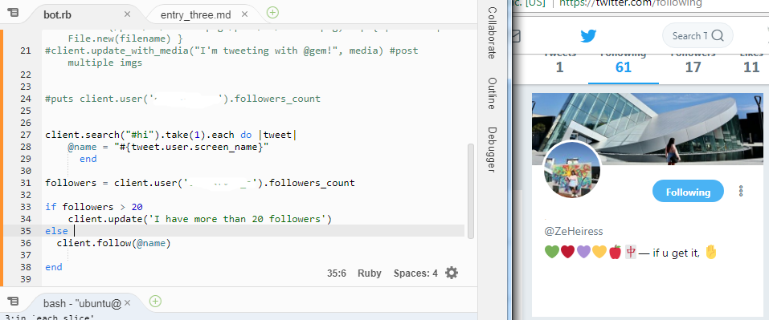

# Continuing to explore Ruby Twitter Bot! 

After figuring out how to tweet from the console I was excited to learn other cool commands that I could do. Therefore, I was looking for ruby documentations but with limited tutorials that explained different methods, it made it harder for me to study using Ruby. I have also looked for videos on youtube but I found that python and node.js are popular amongst users. Luckily I found a link (linked below). I tired each method out to understand how the syntax work.

# Methods

These command can be used by inputting their screen name or id. 

#### To follow: 
```client.follow('userscreenname')``` <br> 
```client.follow (id#)```

#### To unfollow: 
```client.unfollow('userscreenname')```  
```client.follow (id#)```


#### To see how many follower: 
```client.user(screen_name).followers_count```


This image shows that I am looking for a specific username (mine) and printing the number of followers in the console.The number 17 is printed in the console and it matches the number of followers I have. 

# Creating a simple bot

This week's focus was mainly to look for more documentation and other sources that can help me learn.  I was able to learn how to follow, unfollow and see how many followers. I took what I have learned so far and decided to use the if-else statement to write a small running bot. The purpose of this is to test out different ways I can mix the methods together and hopefully brainstorm some creative idea for the final project.  



So what this block of code means is check if I have more than 20 followers. If I have more than 20 followers than I would tweet "I have more than 20 followers". If I have less than 20, then I would look for someone who posted a hashtag of hi and follows them. 

```
client.search("#hi").take(1).each do |tweet|
    @name = "#{tweet.user.screen_name}"
      end 
       
followers = client.user('me').followers_count

if followers > 20 
    client.update('I have more than 20 followers')
else 
  client.follow(@name)
       
end

```

* I also noticed that I needed an instance variable because I am reusing it in my if-else statement* 


# Takeaways
- In this weeks learning, I realized that I should not be afraid to test things out. In order for me to learn, I would need to tinker and mess with the code. The beauty of git is that I can go back to the last commit using the command ```git checkout --filename```. 

- Since there is more than one method to make a twitter bot I could certainly try using python or node.js. Basically, don't let one obstacle prevent you from succeeding. 

- Always be open to creativity. The sample bot that I created was random. I didn't have anything in mind specifically, so I decided to combine these methods together to see what happens. Turns out it works and its pretty cool.  


