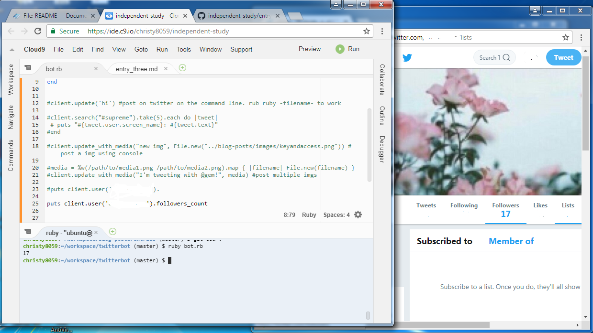

# Continuing to explore Ruby Twitter Bot! 

After figuring out how to tweet from the console I was excited to lean other cool comands that I could do. Thus, I was surfing for documentations. There wasn't alot of people who did tutorials on Ruby twitter bots therefore my sources were limited. I was able to find one documentation. (linked below).  
[Ruby Documentation](http://www.rubydoc.info/gems/twitter) I tired each one out to understand how the syntax works.

These command can be used by inputting their screen name or id. 

#### To follow: 
client.follow('userscreenname') // client.follow (id#)

#### To unfollow: 
client.unfollow('userscreenname') // client.follow (id#)

#### To see how many follower: 
client.user(screen_name).followers_count

This image shows that I am looking at a specific username (mine) and putting the nummer of followers into the console.

#### To 

