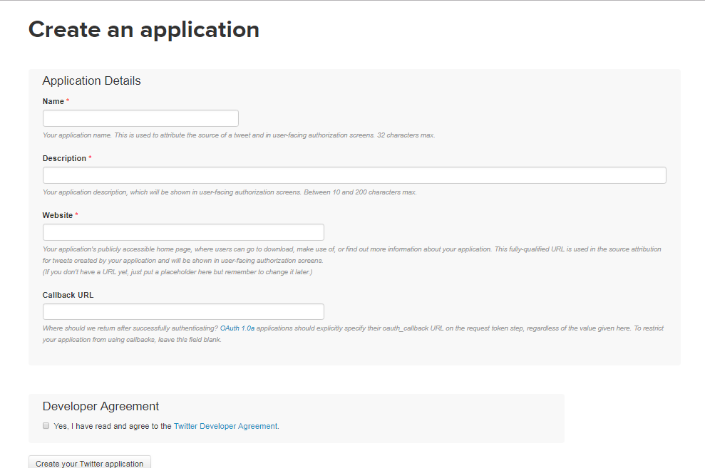

# Twitter Bot! 

After contemplating between the two topics (SASS or Twitter Bot) to study for my indepndent project I chose to stick with Twitter Bots. 

This week was a successful week! I got the Twitter bot to work, meaning I was able to tweet from the command line). 
<br> <br> 
Want to know how?

## Connecting to Twitter 
With the help of a [Ruby Twitter Bot  ](http://www.codebycodes.com/blog/2015/08/31/creating-a-simeple-twitter-bot-with-ruby) tutoral that I found online, I was able to learn how to connect the command line on [Cloud9](https://c9.io) to an existing twitter account (ie: mine).

Twitter is a social platform were individals go on from online or on their phone. But with a few lines of code from the command line we can do incredible things. Besides what I mentioned in my prior post learned some new things that I could do with twitter. 

First, let me explain how to connect your command line with twitter. 

**Step 1:** Create a [twitter app](https://apps.twitter.com/) in order to conneect it to the Twitter API. 



*Fill in the necessary components. For the section that says website you can use  "http://www.example.com" as a filler 

**Step 2:** Log onto Cloud9 and create a new directory ``` mkdir directoryname ```. Then change directory using ```cd directoryname```

**Step 3:** Create a file.  ``` touch filename.rb ```<br> 
*_note: we are using ruby therefore it is a .rb file_*

**Step 4:** In order to use certain syntax we have to install a Twitter Gem using the syntax :``` gem install twitter ```  By doing so c9 knows what we're refering to when using ruby <br> 


**Step 5:** Now to actually connect it to twitter we have to create a client, which is like creating a user. In this client (user) we have to input the configuration variables. 
<br>
The variables consists of keys and token. They can be found in the Keys and Access Token tab. <br> 
 
<br> 

** ATTENTION ** Keep this code private because it is the "password" to your twitter account. 

 <br>

Within the parenethesis you fill in your key and access code that you found before. Now you are done and ready to cold from your command line. 


##### To Test

Every time you test the line of code you will have to run ```ruby filename```

_To post something on twitter:_ 

```
client.update('#hellowworld')
```


This simply tweets from your command line. We have to call client and tell it what we want to do. In order to tweet we have to add .update